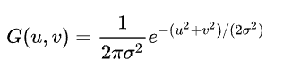
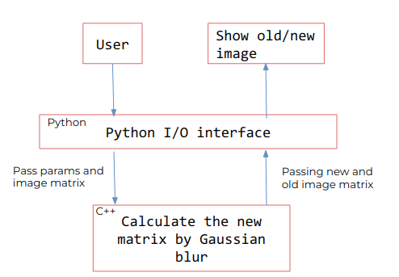

# Gussian bluring for Image  

## Basic Information

There are many ways to blur image, for example box blurring which is to replacing the original value by the average of the nearby values. However, the blurriness provided by some of them are not strong enough even if  the calculation are high. So in this project, I implement a common blurring way which is call **Gussian blur** to improve the quilty and Stability for bluring image.


## Problem to Solve

In this project, I use c++ to make the calculation of image filters faster and use python to show and store image. 


One common way to implement image filtering is using a NxN kernel to convolute the origin image. By setting different value in kernel, you will obtain distinct image after convoluting. Guassian blur is to set the values of kernel by Guassian function.

 

where `u` is the distance from the origin in the horizontal axis, `v` is the distance from the origin in the vertical axis, and σ is the standard deviation of the Gaussian distribution. Setting the kernel with the normal distribution in 2-dimension space will be like this.


1. Convolution matrix radius of Gaussian blur: r (here we set r=1)

2. Standard deviation: σ 
        (it is appropriate to take 1/3 of the radius r of the convolution matrix)

The expecting outcome:
- bluring image
    
    <div>
        
        
    </div>


## Prospective Users

Anyone who wants to bluring the image.

This project use pybind to wrap the c++ based Gussian blur function to provide high-level API in python.

If time is enough, I will implement another bluring ways for users to compare different bluring resluts. 
## System Architecture

```c
class Image:
    // Store pixel of image with array [channel,width,height]
    int ori[c][w][h];   
    int guassian_blur[w][h];

class kernel:

    float map[][]
    update() // update map by different fucntion


def Convolute():
    // convolute the image using map

def Guassian_blur():
    //
     implement guassian algorian and count value on kernel.

```





## API Description

- Python
    - getParam() : get user's parameters.
    - show() : showing the image after filtering.
    - store() : store image in file.
        
- C++
    - Gussianblur() : calculate the gussian blur.
    - Image() : Store every pixel in image
    - Kernel() : store the kernel map
        
## Engineering Infrastructure
- Build System : Makefile
    - make
    - make test
    - make clean
- Version Control : Git
- Test : pytest

## Schedule


- week1(11/07): Setup Python and c++ environment
- week2(11/14): Python I/O interface.
- week3(11/21): Research filter formulas
- week4(11/28): Implement Gussian blur in c++
- week5(12/05): Implement other filter in c++
- week6(12/12): Implement other filter in c++
- week7(12/19): Testing＆ Proposal making 
- week8(12/26): Project Present


picture reference:
https://www.twblogs.net/a/5eddc89bc98ca1ea826e5b2c
https://web.ntnu.edu.tw/~algo/Image.html#3


